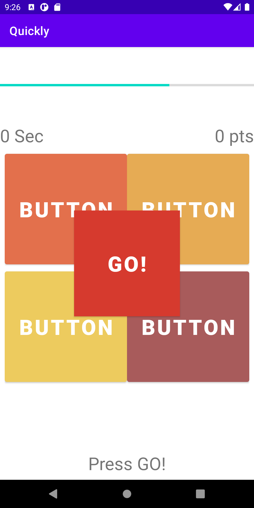

# Quickly
A fun little online math quiz wherein kids get challenged to solve math problems within a time limit.

<!-- Quickly! -->
 

 
 
  <h3 align="center">Quickly!</h3>
  

    A fun little time-challenge Math solving problems! 
     
    <a href="https://github.com/michaelravina/Quickly-"><strong>Explore the docs »</strong></a>
     
  

<!-- TABLE OF CONTENTS -->

  
Table of Contents

  <ol>
    <li>
      <a href="#about-the-project">About The Project</a>
      <ul>
        <li><a href="#built-with">Built With</a></li>
      </ul>
    </li>
    <li><a href="#usage">Usage</a></li>
    <li><a href="#contact">Contact</a></li>
    <li><a href="#acknowledgements">Acknowledgements</a></li>
  </ol>

<!-- ABOUT THE PROJECT -->
## About The Project

Quickly! is an app riddled with simple Math problems for Android users. It is easy to use and can be enjoyed by all ages! A time-limit is set for each challenge and a quick reset is done (3 sec) after each end of the session. 

### Built With

This section should list any major frameworks that you built your project using. Leave any add-ons/plugins for the acknowledgements section. Here are a few examples.
* [Android Studio](https://developer.android.com/studio?gclid=Cj0KCQiAgomBBhDXARIsAFNyUqPrcNelGRGxbaoYdBjys1vo0-DIGwHeZd1j5Yf-RnEziCp8nuC-qVwaAhZNEALw_wcB&gclsrc=aw.ds)
* [Java](hhttps://www.java.com/en/)

<!-- USAGE EXAMPLES -->
## Usage

A step by step guide on how to use the console: 

1. Initial Page where client inputs their names. 

2. A display table with trimmed names is shown as a summary of the input data.

3.The final output wherein the names are trimmed together with all the seat & gate numbers, security code, date & time, etc.

<!-- CONTACT -->
## Contact

Your Name - Michael Ravina - michaelravina@yahoo.com

Project Link: [https://github.com/michaelravina/Quickly-]

Linkedin: [linkedin-url]: https://www.linkedin.com/in/mike-ravina-1368a11a8/

<!-- ACKNOWLEDGEMENTS -->
## Acknowledgements
* Thank you to Dr. Shad for his tutorials on how to create video games from Android studio:

Youtube link: [youtube-url]: https://www.youtube.com/watch?v=44pK7MDexqI&list=PLhPyEFL5u-i3tikmnS9QAFi7YuLWR7q8P&t=0s
