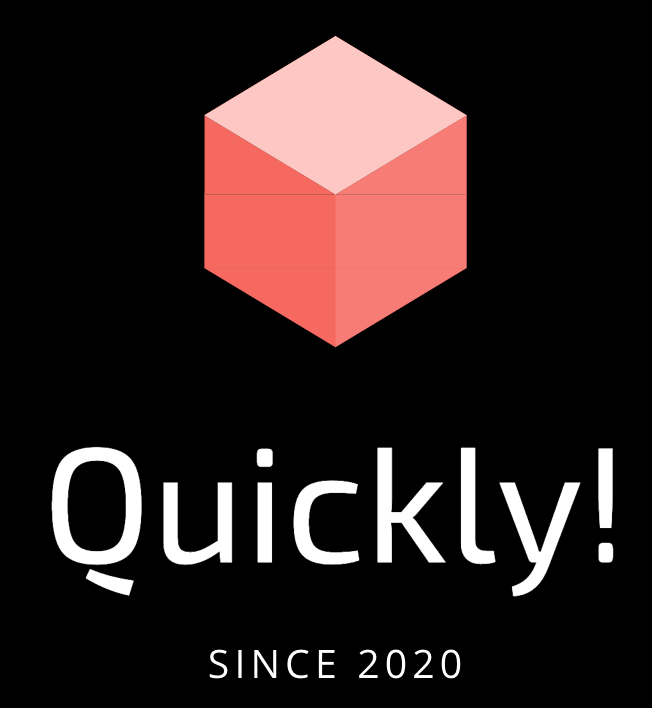

# Quickly
A fun little online math quiz wherein kids get challenged to solve math problems within a time limit.

<!-- Quickly! -->
 

 
 
  <h3 align="center">Quickly!</h3>
  

    A fun little time-challenge Math solving problems! 
     
    <a href="https://github.com/michaelravina/Quickly-"><strong>Explore the docs »</strong></a>
     
  

<!-- TABLE OF CONTENTS -->

  
Table of Contents

  <ol>
    <li>
      <a href="#about-the-project">About The Project</a>
      <ul>
        <li><a href="#built-with">Built With</a></li>
      </ul>
    </li>
    <li><a href="#usage">Usage</a></li>
    <li><a href="#contact">Contact</a></li>
    <li><a href="#acknowledgements">Acknowledgements</a></li>
  </ol>

<!-- ABOUT THE PROJECT -->
## About The Project

Quickly! is an app riddled with simple Math problems for Android users. It is easy to use and can be enjoyed by all ages! A time-limit is set for each challenge and a quick reset is done (3 sec) after each end of the session. 

### Built With

This section should list any major frameworks that you built your project using. Leave any add-ons/plugins for the acknowledgements section. Here are a few examples.
* [Android Studio](https://developer.android.com/studio?gclid=Cj0KCQiAgomBBhDXARIsAFNyUqPrcNelGRGxbaoYdBjys1vo0-DIGwHeZd1j5Yf-RnEziCp8nuC-qVwaAhZNEALw_wcB&gclsrc=aw.ds)
* [Java](https://www.java.com/en/)

<!-- USAGE EXAMPLES -->
## Usage

A step by step guide on how to use the console: 

1. (Above) Initial Page. 

 
 

            

2. Once the GO button is clicked, the timer starts (upper left).

 
 

3. The user is awarded 10 points for every correct question and the number of correct answers is listed on the bottom page.

 
 

4. Above we see the points being added whilst the timer goes down.

 
 

5. Every mistake would penalize the user by -30 points :(.

 
 

6. When Time's UP the final score is tallied and their is an auto-reset to the start page.

<!-- CONTACT -->
## Contact

Your Name - Michael Ravina - michaelravina@yahoo.com

Project Link: [https://github.com/michaelravina/Quickly-]

Linkedin: [linkedin-url]: https://www.linkedin.com/in/mike-ravina-1368a11a8/

<!-- ACKNOWLEDGEMENTS -->
## Acknowledgements
* Thank you to Dr. Shad for his tutorials on how to create video games from Android studio:

Youtube link: [youtube-url]: https://www.youtube.com/watch?v=44pK7MDexqI&list=PLhPyEFL5u-i3tikmnS9QAFi7YuLWR7q8P&t=0s
